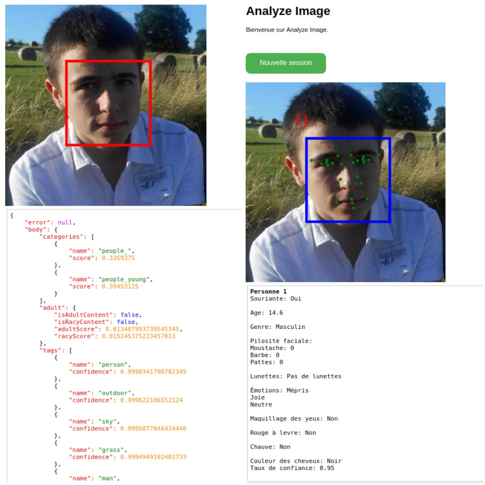

# analyze-image
Analyze image with "Computer Vision" from Microsoft



Get a key: https://azure.microsoft.com/en-us/try/cognitive-services/

Before running the program, you **have to create** a `config.json` file:
```json
{
  "computer_vision_api_key": "f7b99ebbcfea43g9ca7ced14049d7308e",
  "face_api_key": "89ff1223d397457a85eca4d6aa4ec712",
  "address": "example.com"
}
```
